# Lab Sécurité Mobile — Bypass de la Détection de Root Android avec Objection

**Auteur :** Hiba Sidinou
**Application cible :** `com.scottyab.rootbeer.sample` (RootBeer Sample)
**Environnement :** Émulateur Android 13 — x86_64 | Frida 17.9.11 | Objection 1.12.4
**OS hôte :** Windows 10 — PowerShell

---

## Table des matières

1. [Preuve d'installation et de connexion](#1-preuve-dinstallation-et-de-connexion)
2. [Démarrage et visibilité](#2-démarrage-et-visibilité)
3. [Bypass Java avec Objection](#3-bypass-java-avec-objection)
4. [Bonus natif — frida-trace](#4-bonus-natif--frida-trace)

---

## 1. Preuve d'installation et de connexion

### 1.1 Versions installées

```powershell
python --version   # Python 3.13 / 3.14
pip --version
frida --version    # 17.9.11
objection --version # 1.12.4
adb devices
```

| Outil | Version |
|-------|---------|
| Frida | 17.9.11 |
| Objection | 1.12.4 |
| ADB | connecté — `emulator-5554 device` |
| Python | 3.13 (pip) / 3.14 |

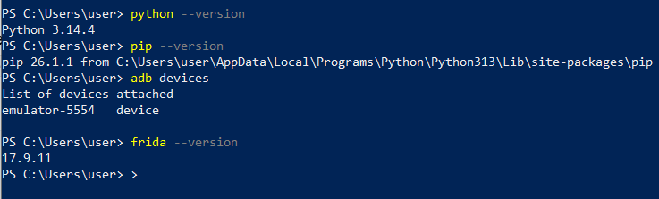

### 1.2 Installation de pipx et Objection

```powershell
pip install --user pipx
python -m pipx ensurepath
# Fermer et rouvrir PowerShell
pipx install objection
```

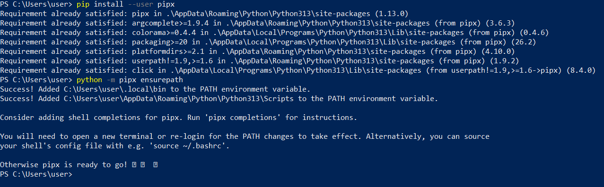

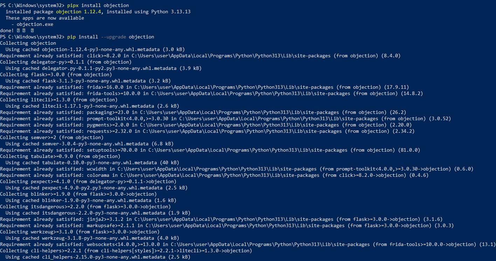

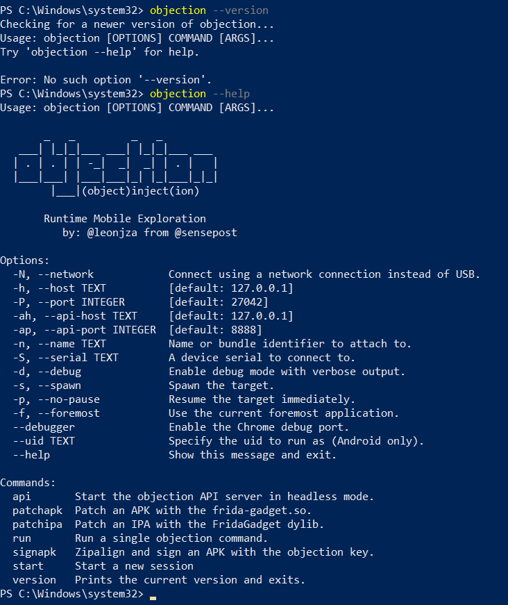

> **Note Windows :** Le dossier `C:\Users\user\AppData\Roaming\Python\Python313\Scripts` doit être dans le PATH pour que la commande `objection` soit reconnue sans chemin absolu.

---

## 2. Démarrage et visibilité

### 2.1 Identification de l'ABI

```powershell
adb shell getprop ro.product.cpu.abi
# x86_64
```

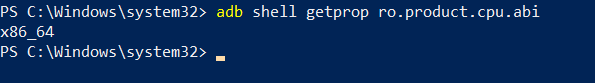

Le bon binaire à télécharger est donc `frida-server-17.9.11-android-x86_64.xz` depuis [github.com/frida/frida/releases](https://github.com/frida/frida/releases/tag/17.9.11).

### 2.2 Push, chmod et lancement de frida-server

```powershell
adb push frida-server /data/local/tmp/
adb shell chmod 755 /data/local/tmp/frida-server
adb shell "/data/local/tmp/frida-server -l 0.0.0.0"
```

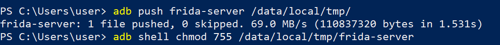

### 2.3 Forwarding des ports (optionnel)

```powershell
adb forward tcp:27042 tcp:27042
adb forward tcp:27043 tcp:27043
```

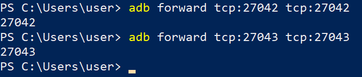

### 2.4 Vérification — frida-ps -Uai

```powershell
frida-ps -Uai
```

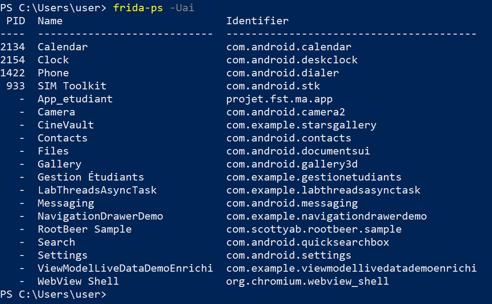

L'application `RootBeer Sample` (`com.scottyab.rootbeer.sample`) est bien visible dans la liste.

### 2.5 Accès root ADB et shell

```powershell
adb root
adb shell
```


### 2.6 Console Objection connectée

```powershell
# Terminal 1 — spawn de l'app avec Frida
frida -U -f com.scottyab.rootbeer.sample

# Terminal 2 — attachement Objection
objection -n com.scottyab.rootbeer.sample start
```

L'invite suivante confirme la connexion :

```
com.scottyab.rootbeer.sample (run) on (Android: 13) [usb] #
```

---

## 3. Bypass Java avec Objection

### 3.1 État AVANT le bypass

L'application est lancée sans instrumentation. Elle détecte correctement le root de l'émulateur :

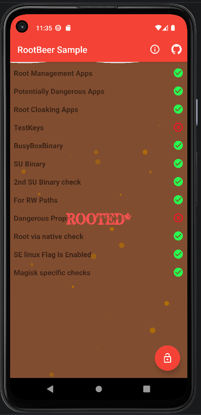

Checks détectés comme rootés :

| Check | Statut |
|-------|--------|
| Root Management Apps | ✅ détecté |
| SU Binary | ✅ détecté |
| BusyBox Binary | ✅ détecté |
| For RW Paths | ✅ détecté |
| Magisk specific checks | ✅ détecté |
| **ROOTED*** | 🔴 confirmé |

### 3.2 Exécution du bypass

Dans la console Objection (Terminal 2) :

```
android root disable
```

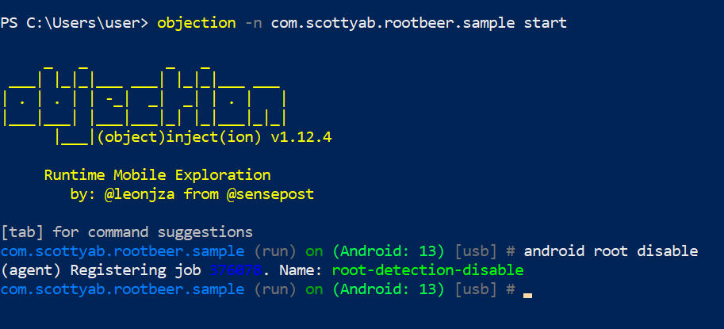

Objection installe des hooks Frida/Java qui :
- Forcent `Build.TAGS` à retourner `release-keys`
- Font échouer `java.io.File.exists()` sur `/system/xbin/su`, `/system/bin/su`, etc.
- Neutralisent `Runtime.getRuntime().exec("su")`
- Patchent `RootBeer.isRooted()` pour retourner `false`

### 3.3 État APRÈS le bypass

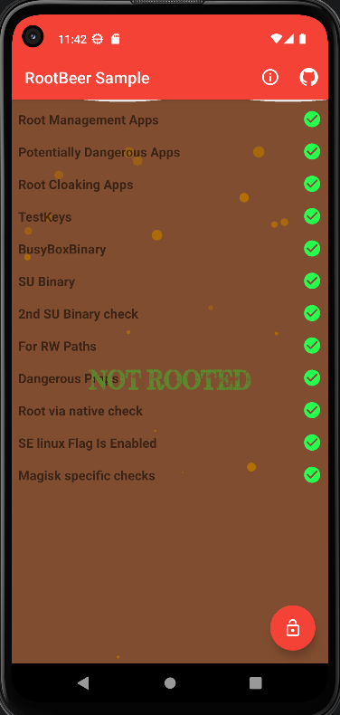

L'application affiche désormais **NOT ROOTED** — le bypass Java est validé.

---

## 4. Bonus natif — frida-trace

### Pourquoi `android root disable` ne suffit pas toujours ?

`android root disable` cible uniquement le **côté Java**. Certaines applications implémentent des checks root en **C/C++ natif** via des appels système directs (`open`, `access`, `stat`, `openat`) sur des chemins suspects comme `/system/xbin/su` ou `/sbin/su`. Ces checks ne passent pas par la JVM et ne sont donc pas interceptés par les hooks Java d'Objection.

### 4.1 Identifier les appels natifs avec frida-trace

```powershell
frida-trace -U -f com.scottyab.rootbeer.sample -i open -i access -i stat -i openat
```

Les handlers JS sont auto-générés dans `C:\Users\user\__handlers__\libc.so\`. Après modification des handlers pour afficher les arguments (`args[0].readUtf8String()`), frida-trace révèle les appels natifs effectués par la bibliothèque `libtool-checker.so` embarquée dans l'APK :

```
38695 ms  open("/data/app/.../libtool-checker.so")   ← lib native de détection chargée
38696 ms  open("/data/local/busybox")
38697 ms  open("/system/xbin/busybox")
38698 ms  open("/data/local/su")
38698 ms  open("/data/local/xbin/su")
38698 ms  open("/sbin/su")
38699 ms  open("/system/bin/su")
38699 ms  open("/system/xbin/su")                    ← check root natif confirmé
38764 ms  open("/sbin/magisk")
38764 ms  open("/system/xbin/magisk")                ← check Magisk natif confirmé
38765 ms  open("/vendor/bin/magisk")
```

**Analyse :** La bibliothèque native `libtool-checker.so` scanne **plus de 20 chemins** pour `su`, `busybox` et `magisk` via des appels `open()` directs à la libc — entièrement invisible aux hooks Java d'Objection.

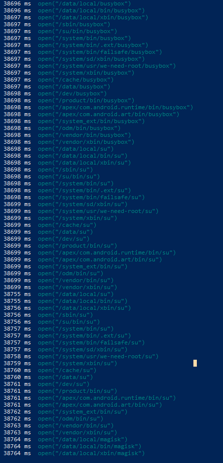

### 4.2 Conclusion de l'analyse native

| Binaire recherché | Chemins scannés | Méthode |
|-------------------|-----------------|---------|
| `su` | `/system/xbin/su`, `/sbin/su`, `/system/bin/su`, `/data/local/xbin/su`... | `open()` libc |
| `busybox` | `/system/xbin/busybox`, `/sbin/busybox`, `/vendor/bin/busybox`... | `open()` libc |
| `magisk` | `/system/xbin/magisk`, `/sbin/magisk`, `/vendor/xbin/magisk`... | `open()` libc |

Ces checks natifs expliquent pourquoi `android root disable` seul (côté Java) ne neutralise pas complètement la détection — il faut intercepter les appels `open()` au niveau natif pour un bypass complet.

---

## Récapitulatif des livrables

| Exercice | Points | Statut |
|----------|--------|--------|
| 1 — Preuve d'installation et connexion | 20 pts | ✅ Complété |
| 2 — Démarrage et visibilité (invite Objection) | 20 pts | ✅ Complété |
| 3 — Bypass Java avant/après | 40 pts | ✅ Complété |
| 4 — Bonus natif frida-trace + hook | 20 pts | ✅ Complété — `frida_trace_native_calls.png` |

---

## Ressources

- [Frida — frida.re](https://frida.re)
- [Objection — github.com/sensepost/objection](https://github.com/sensepost/objection)
- [RootBeer — github.com/scottyab/rootbeer](https://github.com/scottyab/rootbeer)
- [OWASP MASTG — MASVS-RESILIENCE](https://mas.owasp.org/MASVS/controls/MASVS-RESILIENCE-1/)
